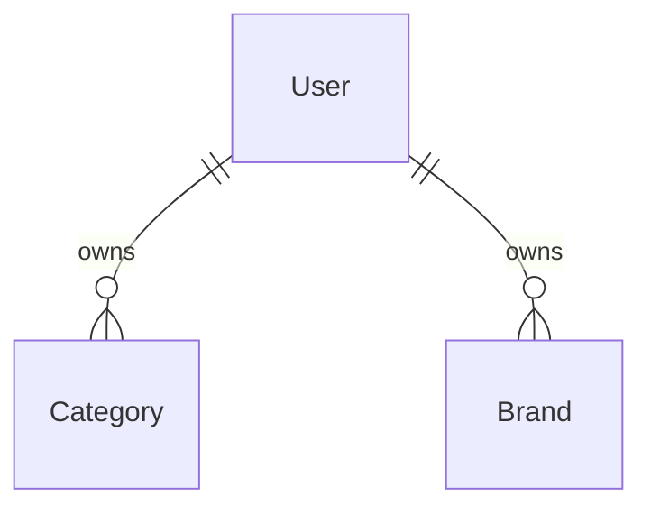

# On Store API

A RESTful e-commerce backend API built with **Node.js, TypeScript, Express 5, and MongoDB (Mongoose)**.

The project follows a module-based, layered architecture: every business domain lives in `src/modules/<name>/` with model, controller, service, validation, routes, and index files. As of the current implementation state, **Authentication**, **Categories**, and **Brands** are implemented, while the remaining e-commerce modules (products, cart, orders, payments, etc.) are scaffolded but not yet functional.

> **Status note:** This README documents the project **as it currently exists**. Anything not implemented is explicitly labeled. Planned features are never presented as completed.

---

## Table of Contents

- [Overview](#overview)
- [Features](#features)
- [User Roles](#user-roles)
- [Application Architecture](#application-architecture)
- [Project Structure](#project-structure)
- [Technology Stack](#technology-stack)
- [Backend](#backend)
- [API](#api)
- [Database](#database)
- [Frontend](#frontend)
- [Authentication & Security](#authentication--security)
- [Environment Variables](#environment-variables)
- [Installation](#installation)
- [Available Scripts](#available-scripts)
- [Testing](#testing)
- [Deployment](#deployment)
- [Current Project Status](#current-project-status)
- [Limitations](#limitations)
- [Future Improvements](#future-improvements)
- [Development Notes](#development-notes)
- [Conclusion](#conclusion)

---

## Overview

### What it is

`on-store-api` is the backend REST API for an e-commerce application. It exposes JSON endpoints under the `/api/v1` prefix and stores data in MongoDB.

### Main purpose

Provide the server-side foundation for a store: user accounts and authentication, plus catalog management (categories and brands). A set of additional commerce modules — products, cart, coupons, orders, payments, ratings, reviews, wishlist — is prepared as module skeletons for later implementation.

### Target users

- **Developers** integrating the API (no frontend ships in this repository).
- **Merchants and admins** — the two roles defined by the registration flow — once role-based access control is implemented.

### Main workflow today

1. A user registers (`POST /auth/register`) or logs in (`POST /auth/login`) and receives a JWT.
2. A client calls the public catalog endpoints for categories and brands.
3. All other commerce flows (browse products, cart, order, pay) are scaffolded only.

### Current scope

- Implemented: authentication (register/login/logout), categories CRUD, brands CRUD.
- Registered but non-functional: users, products, cart, coupons, orders, payments, ratings, reviews, wishlist (empty controller stubs; requests never receive a response).
- No tests, no deployment configuration, no frontend.

---

## Features

### Authentication & Authorization

- **Register** — creates a user with `username`, `email`, `phoneNumber`, `password`, `role`; hashes the password with bcrypt (12 rounds); returns the user plus a JWT.
- **Login** — looks up the user by email, compares the password with bcrypt, and returns the user plus a JWT.
- **Logout** — requires an `Authorization` header and confirms logout (no token is revoked or blacklisted).
- Validation rules are declared on all three endpoints, but auth routes do not run the `validateRequest` middleware inline (see [Limitations](#limitations)).
- **Not implemented:** JWT verification middleware, protected routes, and role-based access control. Tokens are issued but never checked by any endpoint.

### Categories

- Create, list (paginated), get by id, update, delete.
- Validation: create requires `name`, `slug`, `image`, `owner`; update allows optional `name` and `image`; `:id` must be a valid MongoDB ObjectId.

### Brands

- Create, list (paginated), get by id, update, delete.
- Validation mirrors the Categories module.

### Scaffolded modules (not implemented)

Routes are registered and controller stubs exist (`() => {}`), but models, services, and validations are empty and no response is ever sent:

`users`, `products`, `cart`, `coupons`, `orders`, `payments`, `ratings`, `reviews`, `wishlist`.

---

## User Roles

Two roles are defined by the registration validation and the `User` schema enum. **No authorization logic currently distinguishes them** — roles are stored on the user document and embedded in the JWT payload, but nothing is enforced server-side.

| Role     | Defined in                          | Can do today                         | Notes                                      |
| -------- | ----------------------------------- | ------------------------------------ | ------------------------------------------ |
| Merchant | `auth.model.ts` enum, default role  | Register / login; call any endpoint  | Intended as the content-owner role         |
| Admin    | `auth.model.ts` enum                | Register / login; call any endpoint  | No elevated permissions implemented yet    |

Because no route is protected, endpoint access is currently identical for both roles (and for unauthenticated clients).

---

## Application Architecture

### High-level

The application is a **modular monolith**:

```text
Request
  ↓
Global middleware (cors, morgan, express.json)
  ↓
Module router mounted at /api/v1/<module>
  ↓
Route-level validation rules (express-validator)
  ↓
validateRequest middleware
  ↓
Controller (business logic + response building)
  ↓
Mongoose model
  ↓
MongoDB
```

### Middleware chain (in `src/app.ts`)

1. `cors()` — permits cross-origin requests.
2. `morgan('dev')` — HTTP request logging.
3. `express.json({ limit: '1mb' })` — JSON body parsing with a 1 MB cap.
4. Module routers mounted under `/api/v1/*`.
5. `validateRequest` — global check of collected validation results.
6. `errorHandler` — centralized error responses.

### Layering and design patterns

- **Module-based organization** — each domain is self-contained under `src/modules/<name>/`.
- **Route → validation → controller → model** flow. Validation rules are declared in per-module `*.validation.ts` files and executed through the shared `validateRequest` middleware.
- **Service layer is a convention only** — `*.service.ts` files exist in every module but are empty. Controllers query Mongoose models directly.
- Express `Router` per module; controllers are plain `async` handlers that build responses inline.

---

## Project Structure

```text
.
├── .env                         # environment variables (gitignored; no .env.example)
├── .gitignore
├── package.json
├── tsconfig.json
├── diagrams/                    # architecture diagrams (.drawio)
│   ├── E-commerc Diagram.drawio # overall target architecture
│   └── <module>/<module>.drawio # per-module diagrams
├── postman/
│   └── On-Store-API.postman_collection.json  # Postman collection
└── src/
    ├── app.ts                   # entry point — middleware chain + route registration
    ├── .prettierrc              # Prettier config
    ├── config/
    │   └── db.ts                # Mongoose connection (APP_URL)
    ├── middlewares/
    │   ├── validateRequest.ts   # validation-result middleware (implemented)
    │   ├── errorHandler.ts      # centralized error handler (implemented)
    │   └── notFound.ts          # empty — no 404 handler registered
    └── modules/
        ├── auth/                # implemented — register, login, logout + User model
        ├── categories/          # implemented — CRUD + get by id + pagination
        ├── brands/              # implemented — CRUD + get by id + pagination
        └── users|products|cart|coupons|orders|payments|ratings|reviews|wishlist/
                                 # scaffolded — routes + empty controller stubs,
                                 #   empty model/service/validation files
```

Each module (except the entry point) follows the same convention:

```text
<name>/
├── <name>.controller.ts   # HTTP handlers
├── <name>.model.ts        # Mongoose schema/model
├── <name>.routes.ts       # Express router
├── <name>.service.ts      # empty (planned service layer)
├── <name>.validation.ts   # express-validator rules
├── index.ts               # barrel re-exports
└── README.md              # module documentation
```

---

## Technology Stack

| Technology        | Version      | Purpose                                            |
| ----------------- | ------------ | -------------------------------------------------- |
| Node.js           | —            | Runtime (ES Modules, `"type": "module"`)           |
| Express           | ^5.2.1       | HTTP framework                                    |
| TypeScript        | ^5.9.3       | Language, strict mode, `NodeNext` resolution       |
| Mongoose          | ^9.9.4       | ODM — schemas, models, queries                     |
| MongoDB driver    | ^7.6.0       | Database driver (`mongodb` dependency)             |
| express-validator | ^7.3.2       | Request validation                                 |
| bcrypt            | ^6.0.0       | Password hashing (12 rounds)                       |
| jsonwebtoken      | ^9.0.3       | JWT signing (HS256)                                |
| cors              | ^2.8.6       | Cross-origin request handling                       |
| morgan            | ^1.12.1      | HTTP request logging                               |
| dotenv            | ^17.4.2      | Environment variable loading                        |
| nodemon + tsx     | ^3.1.0 / ^4.23.13 | Development runner (TypeScript hot reload)    |
| prettier          | ^3.9.6       | Code formatting (`npm run format`)                 |

Installed but **not used in the code**:

- `multer` — no file upload code.
- `nodemailer` — no email code.
- `jest`, `ts-jest`, `supertest`, `ts-node` — no tests or test script exist.

---

## Backend

### Framework

Express 5 with TypeScript, compiled via `tsc` to `./dist`, run with `tsx`/`nodemon` in development. TypeScript strict mode, ESM, `NodeNext` module resolution.

### Module structure

Every domain is a self-contained package under `src/modules/<name>/` (controller, model, routes, validation, empty service, barrel `index.ts`) and is mounted in `src/app.ts` as an Express router.

### Controllers

Plain async Express handlers that perform database operations and build JSON responses inline. Implemented controllers are in the `auth`, `categories`, and `brands` modules. In create/list/get/update/delete flows, controllers call Mongoose directly (e.g., `Category.create`, `Brand.findById`, `findByIdAndUpdate`).

### Routes

Routers register REST-style endpoints. Implemented modules apply their validation rules at the route level and then `validateRequest`. Validation is defined per module in `*.validation.ts`.

### Middleware

- `validateRequest` (`src/middlewares/validateRequest.ts`) — reads `validationResult(req)`; on failure responds `400` with `{ "status": "fail", "errors": [...] }`.
- `errorHandler` (`src/middlewares/errorHandler.ts`) — last middleware; responds with `err.statusCode` (default `500`) and `status: "error" | "fail"` depending on status code.
- `notFound.ts` — empty; no 404 handler is registered (unknown routes fall through to Express's default 404).

### Validation

express-validator chains defined per route, e.g.:

- `registerValidation` — `username` non-empty, `email` is email, `phoneNumber` non-empty, `password` ≥ 6 chars, `role` in `['merchant', 'admin']`.
- `loginValidation` — `email` is email, `password` non-empty.
- `tokenValidation` — `authorization` header present (used by logout).
- Category/Brand create rules require non-empty `name`, `slug`, `image`, `owner`; ObjectId params validated with `isMongoId()`.

**Enforcement note:** the `validateRequest` middleware is applied **inline** only on the category and brand routes. The auth routes attach their validation chains but register them alongside a global `app.use(validateRequest)` that runs *after* each route completes, so validation failures on auth endpoints are not short-circuited before the controller runs (see [Limitations](#limitations)).

### Authentication

JWT signing occurs in `register` and `login` (`jwt.sign` with `TOKEN_SECRET`, algorithm `HS256`, `expiresIn: '1m'`). There is **no authentication middleware** — tokens are never verified (`jwt.verify` is not used anywhere) and no route is protected.

### Error handling

Errors are delegated to the shared `errorHandler`. Controllers also return explicit 4xx responses (e.g., `404 "Category not found"`, `401 "Invalid password"`, `404 "User not found"`). Mongoose-level failures (e.g., validation errors from the model) currently surface as HTTP 500 responses.

### Database integration

`src/config/db.ts` connects via Mongoose to `APP_URL`, throwing if the variable is missing. The server starts listening only after a successful connection.

---

## API

All routes are mounted under the `/api/v1` prefix. **No route currently requires authentication** — every endpoint is effectively public.

### Implemented endpoints

#### Auth

| Method | Endpoint               | Purpose                               | Response shape                                   |
| ------ | ---------------------- | -------------------------------------- | ------------------------------------------------ |
| POST   | `/api/v1/auth/register` | Create a user, issue a JWT             | `201` `{ status, data: { newUser, token } }`     |
| POST   | `/api/v1/auth/login`    | Authenticate, issue a JWT              | `200` `{ status, data: { user, token } }`        |
| POST   | `/api/v1/auth/logout`   | Require a bearer token, confirm logout | `200` `{ status, message }`                      |

Login errors: `404 { status: "error", message: "User not found" }` and `401 { status: "error", message: "Invalid password" }`.

#### Categories & Brands

Both modules implement the same REST pattern.

| Method | Endpoint             | Description                 | Validation applied                                |
| ------ | -------------------- | --------------------------- | ------------------------------------------------- |
| GET    | `/api/v1/categories` | Paginated list              | —                                                 |
| GET    | `/api/v1/categories/:id` | Single category by id   | `validateCategoryId`                              |
| POST   | `/api/v1/categories` | Create a category           | `createCategoryValidation` + `validateRequest`    |
| PATCH  | `/api/v1/categories/:id` | Update a category       | `validateCategoryId` + `updateCategoryValidation` |
| DELETE | `/api/v1/categories/:id` | Delete a category       | `validateCategoryId`                              |
| GET    | `/api/v1/brands`      | Paginated list              | —                                                 |
| GET    | `/api/v1/brands/:id`  | Single brand by id          | `validateBrandId`                                 |
| POST   | `/api/v1/brands`      | Create a brand              | `createBrandValidation` + `validateRequest`       |
| PATCH  | `/api/v1/brands/:id`  | Update a brand              | `validateBrandId` + `updateBrandValidation`       |
| DELETE | `/api/v1/brands/:id`  | Delete a brand              | `validateBrandId`                                 |

List query parameters:

- `page` — page number (default `1`)
- `limit` — results per page (default `25`)
- `search` — intended name filter, **currently non-functional** (see [Limitations](#limitations))

Response shapes (verified from controller code):

```jsonc
// 200 list
{ "status": "success", "results": 1, "data": { "allCategories": [] } }

// 200 get one / patch update
{ "status": "success", "data": { "category": {} } }

// 201 create
{ "status": "success", "data": { "newCategory": {} } }

// 200 delete
{ "status": "success", "message": "Category deleted successfully" }

// 404 missing document
{ "status": "failed", "message": "Category not found" }

// 400 validation failure (validateRequest)
{ "status": "fail", "errors": [] }
```

### Registered but non-functional endpoints

The following modules register routes that delegate to **empty controller stubs** (`() => {}`). Models, services, and validations are empty, and no response is ever sent — requests to these endpoints hang until the handlers are implemented.

| Module   | Registered routes |
| -------- | ----------------- |
| users    | `GET/POST /api/v1/users`, `PATCH/DELETE /api/v1/users/:id` |
| products | `GET/POST /api/v1/products`, `PATCH/DELETE /api/v1/products/:id` |
| cart     | `GET/POST /api/v1/cart`, `PATCH/DELETE /api/v1/cart/:id` |
| coupons  | `GET/POST /api/v1/coupons`, `PATCH/DELETE /api/v1/coupons/:id` |
| orders   | `GET/POST /api/v1/orders`, `PATCH/DELETE /api/v1/orders/:id` |
| payments | `GET/POST /api/v1/payments`, `PATCH/DELETE /api/v1/payments/:id` |
| ratings  | `GET/POST /api/v1/ratings`, `PATCH/DELETE /api/v1/ratings/:id` |
| reviews  | `GET/POST /api/v1/reviews`, `PATCH/DELETE /api/v1/reviews/:id` |
| wishlist | `GET/POST /api/v1/wishlist`, `PATCH/DELETE /api/v1/wishlist/:id` |

---

## Database

### Technology

MongoDB, accessed through Mongoose ODM. Connection string comes from `APP_URL`; `connectDB()` throws if it is missing.

### Models

Only three Mongoose models are actually implemented (the `User` model is defined in the `auth` module; `users.model.ts` is empty).

```text
User
 ├── username     (String, required, trimmed)
 ├── email        (String, required, unique, trimmed)
 ├── phoneNumber  (String, required, unique, trimmed)
 ├── password     (String, required, minlength 6, stored bcrypt-hashed)
 └── role         (String, enum ['merchant', 'admin'], default 'merchant')
timestamps: true · versionKey: false

Category
 ├── name   (String, required, trimmed)
 ├── image  (String, required)
 ├── slug   (String, required, unique, trimmed)
 └── owner  (ObjectId → User, required)
timestamps: true · versionKey: false

Brand
 ├── name   (String, required, trimmed)
 ├── image  (String, required)
 ├── slug   (String, required, unique, trimmed)
 └── owner  (ObjectId → User, required)
timestamps: true · versionKey: false
```

### Relationships & constraints



- `Category.owner` and `Brand.owner` reference the `User` model.
- Unique indexes: `Category.slug`, `Brand.slug`, `User.email`, `User.phoneNumber`.
- **Known issue:** category/brand create controllers do not pass the required `owner` field, so create requests currently fail with a Mongoose validation error (HTTP 500).

All other `*.model.ts` files (`Product`, `Cart`, `Coupon`, `Order`, `Payment`, `Rating`, `Review`, `Wishlist`, and `users/User`) are **empty** — the only `User` model in the codebase is the one defined in `src/modules/auth/auth.model.ts`.

---

## Frontend

There is **no frontend** in this repository. The project is a backend API only; no client app, pages, or UI code exist.

---

## Authentication & Security

What is actually implemented:

- **Password hashing** — bcrypt with 12 salt rounds (`auth.controller.ts`).
- **JWT issuance** — HS256 tokens signed with `TOKEN_SECRET`, `expiresIn: '1m'`, containing `userId` and `role`.
- **Request validation** — express-validator chains on category and brand routes, enforced inline by the shared `validateRequest` middleware. Auth routes declare validation chains but do not apply `validateRequest` inline.
- **CORS** — enabled globally via `cors()`.
- **Body size limit** — `express.json({ limit: '1mb' })`.

What is **not** implemented:

- No `jwt.verify` usage — tokens are never validated, so there are no protected routes.
- No role-based access control.
- No rate limiting.
- No security headers middleware (e.g., helmet).
- No input sanitization beyond body validation.
- No token revocation or blacklist on logout.
- No 404 handler.

---

## Environment Variables

Configuration is loaded with `dotenv` from `.env` (gitignored — **no `.env.example` is provided** in the repository).

| Variable       | Used in                            | Purpose                          |
| -------------- | ---------------------------------- | -------------------------------- |
| `APP_PORT`     | `src/app.ts`                       | Port the HTTP server listens on  |
| `APP_URL`      | `src/config/db.ts`                 | MongoDB connection string        |
| `TOKEN_SECRET` | `src/modules/auth/auth.controller.ts` | Secret used to sign JWTs     |

```env
APP_PORT=3000
APP_URL=mongodb://127.0.0.1:27017/on-store
TOKEN_SECRET=your-random-secret
```

> Do not commit a real `TOKEN_SECRET`; the value above is illustrative.

---

## Installation

### Prerequisites

- Node.js (with npm)
- MongoDB (local instance or a MongoDB connection string)

### Setup

1. Clone the repository:

```bash
git clone <repository-url>
cd "On Store Api"
```

2. Install dependencies:

```bash
npm install
```

3. Create a `.env` file at the project root (see [Environment Variables](#environment-variables)):

```bash
APP_PORT=3000
APP_URL=mongodb://127.0.0.1:27017/on-store
TOKEN_SECRET=your-random-secret
```

4. Make sure MongoDB is running, then start the development server:

```bash
npm run dev
```

The server connects to MongoDB and then listens on `APP_PORT`. API base URL: `http://localhost:3000/api/v1`.

---

## Available Scripts

| Command          | Description                                                    |
| ---------------- | -------------------------------------------------------------- |
| `npm run dev`    | Development server with hot reload (`nodemon --exec tsx src/app.ts`) |
| `npm run build`  | Compile TypeScript to `./dist` (`tsc`)                         |
| `npm start`      | Run the compiled app (`nodemon dist/app.js`) — requires `npm run build` first |
| `npm run format` | Format the whole project (`prettier --write .`)                |

There is **no test script** in `package.json`.

---

## Testing

**No tests are currently implemented.** `jest`, `ts-jest`, `supertest`, and related type packages are installed as dev dependencies, but there is no test script, no jest configuration, and no `*.test.*`/`*.spec.*` files. The only verification artifacts are the Postman collection requests and their in-collection scripts.

---

## Deployment

There is **no deployment configuration**: no Dockerfile, no CI/CD pipeline, no platform config (Heroku/Vercel/etc.), and no production environment setup. `npm start` runs the compiled output through `nodemon`, which is development-oriented. The project currently runs locally only.

---

## Current Project Status

### Implemented

- Express + TypeScript + Mongoose scaffolding (ESM, strict TS).
- Global middleware chain (CORS, morgan logging, JSON parsing, `validateRequest`, `errorHandler`).
- Database connection via Mongoose (`config/db.ts`).
- **Auth module** — register, login, logout with bcrypt hashing and JWT signing.
- **Categories module** — CRUD + get by id + pagination + validation.
- **Brands module** — CRUD + get by id + pagination + validation (mirrors Categories).
- Postman collection with requests for the implemented endpoints.

### Partially implemented / known broken flows

- Register/login successfully hash and issue tokens, but tokens are never verified (no protected routes).
- Category/Brand **create** routes fail at the database level because the required `owner` is validated but not persisted by the controller.

### Registered but non-functional (scaffolded)

- Module skeletons for `users`, `products`, `cart`, `coupons`, `orders`, `payments`, `ratings`, `reviews`, `wishlist` — routes exist; controllers are empty stubs; models/services/validations are empty. Requests to these endpoints never receive a response.

### Not implemented

- JWT verification / authentication middleware / protected routes.
- Role-based access control (roles exist in the schema only).
- 404 handler (`notFound.ts` is empty and unused).
- Tests.
- File uploads (multer installed, unused) and emails (nodemailer installed, unused).
- Frontend and deployment configuration.

---

## Limitations

- **No token verification** — `jwt.verify` is never used; any issued token is accepted nowhere and required nowhere. All endpoints are public.
- **JWT expiry is 1 minute** (`expiresIn: '1m'`), which is impractical for real sessions and not configurable.
- **Logout is a no-op** — it checks for an `Authorization` header and returns success; tokens are not invalidated or blacklisted.
- **Auth validation is not enforced before handlers** — auth routes attach `registerValidation`/`loginValidation`/`tokenValidation` but do not run `validateRequest` inline; the global `validateRequest` runs only after a route completes, so invalid auth payloads are not rejected with `400` before the controller processes them.
- **Password hash exposure** — register/login responses include the user document, which contains the bcrypt-hashed password.
- **`owner` mismatch** — `createCategoryValidation`/`createBrandValidation` require `owner`, but the controllers drop it and the models require it, so creates fail (HTTP 500).
- **`search` filter bug** — list controllers only apply the name filter when `search === 'string'` (a literal string comparison instead of a type check); real search values are ignored.
- **Scaffolded endpoints hang** — empty controller stubs send no response.
- **No 404 handling** — unknown routes return Express's default HTML 404 instead of a JSON envelope.
- **No tests, no CI, no deployment config.**
- **`src/middlewares/notFound.ts` and all `*.service.ts` files are empty** — the service layer is a file convention only.

---

## Future Improvements

These are planned directions implied by the current codebase, **not implemented functionality**:

- Authentication middleware that verifies JWTs and protects routes.
- Persist `owner` on category/brand creation and enforce ownership.
- Role-based access control for `merchant` / `admin`.
- Functional implementations of the scaffolded modules (products, cart, orders, payments, coupons, ratings, reviews, wishlist, users).
- Fix the `search` filter on list endpoints.
- JSON 404 handler.
- Automated tests with jest + supertest and a `test` script.
- File upload support (multer is installed).
- Email notifications (nodemailer is installed).
- Production build/run and deployment setup.

---

## Development Notes

- **Entry point:** `src/app.ts` registers global middleware and mounts all module routers; the server only starts after the MongoDB connection succeeds.
- **Module convention:** controller / model / routes / validation / service / index per module. `index.ts` re-exports the module's public API.
- **Service layer:** `*.service.ts` files are placeholders; controllers currently talk to Mongoose directly.
- **Import style:** ESM with explicit `.js` extensions in relative imports (`import ... from './auth.routes.js'`).
- **Formatting:** Prettier with `singleQuote`, `semi`, 2-space indent, print width 100 (see `src/.prettierrc`).
- **Postman collection:** `postman/` contains a collection exercising the implemented endpoints. **Note:** the collection's embedded descriptions are partially stale — they state that login/logout and validation are unimplemented, but these are implemented in the current code (`auth.controller.ts`, `auth.validation.ts`).
- **Diagrams:** `diagrams/` holds `.drawio` architecture files, including the target overall design (`E-commerc Diagram.drawio`) and per-module diagrams. The overall diagram describes a target architecture broader than the current implementation.
- **Unused dependencies:** `multer` and `nodemailer` are installed but not referenced; jest/ts-jest/supertest are installed but no tests exist.
- **TypeScript config:** strict mode, target ES2022, `NodeNext` module/resolution, `rootDir: src`, `outDir: dist`.

---

## Conclusion

`on-store-api` is a cleanly scaffolded, module-based e-commerce backend. Its implemented surface today is a working authentication flow (register/login/logout with bcrypt and JWT) plus complete CRUD for categories and brands. The architecture — Express 5 + TypeScript + Mongoose with per-module file conventions and shared middleware — is well set up for expansion, but nine of twelve modules are still empty stubs, tokens are never verified, and there is no test or deployment setup. It is a solid foundation with the core identity and catalog workflows working, not yet a production-ready store platform.